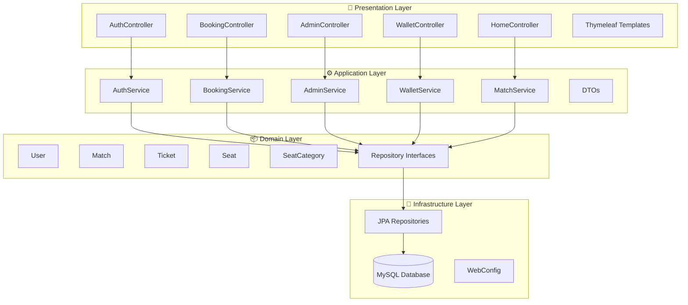
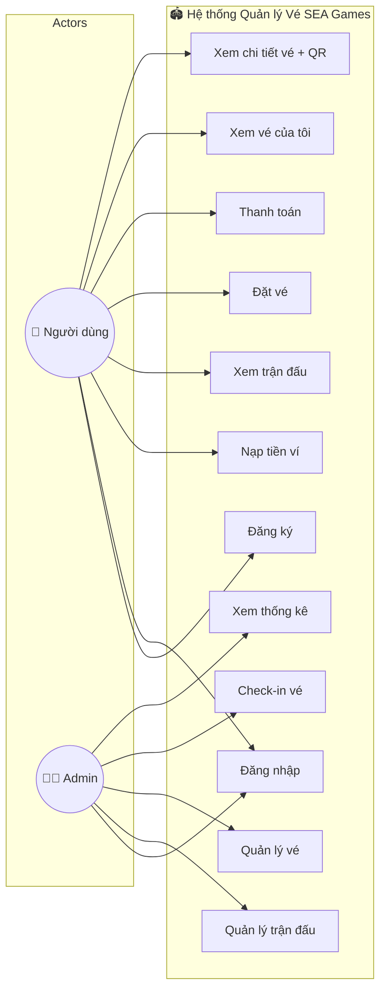
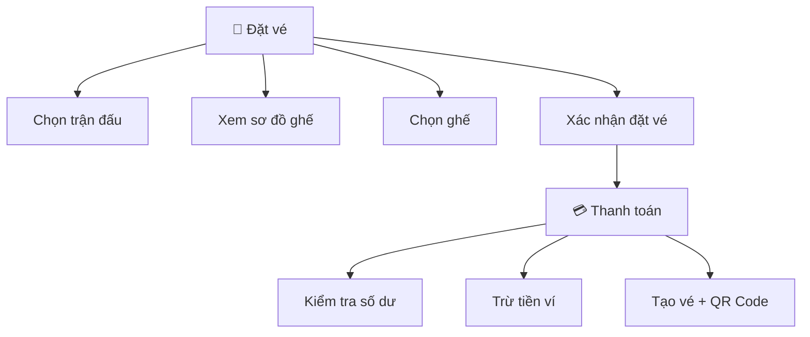
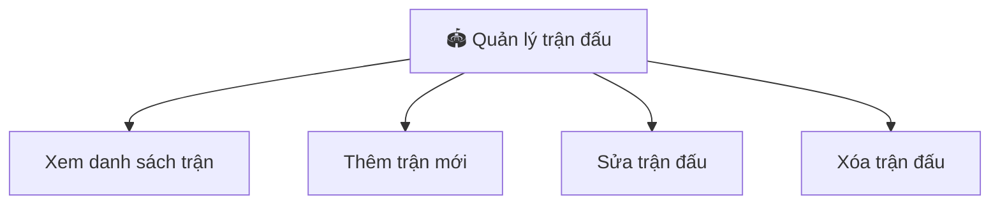
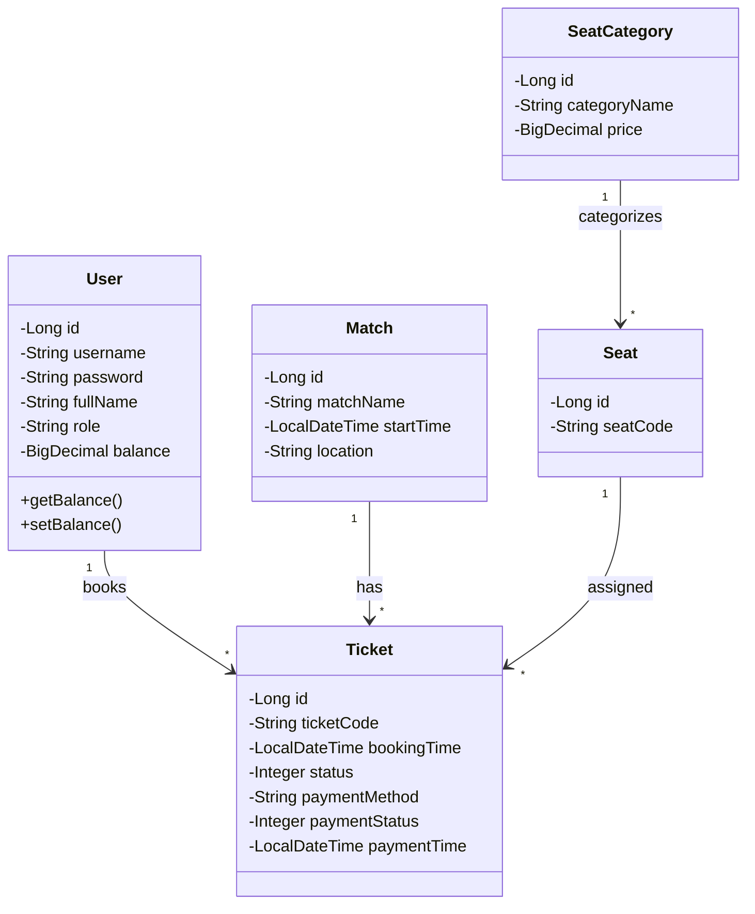
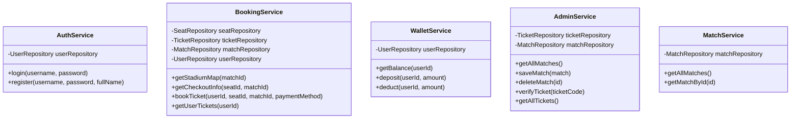
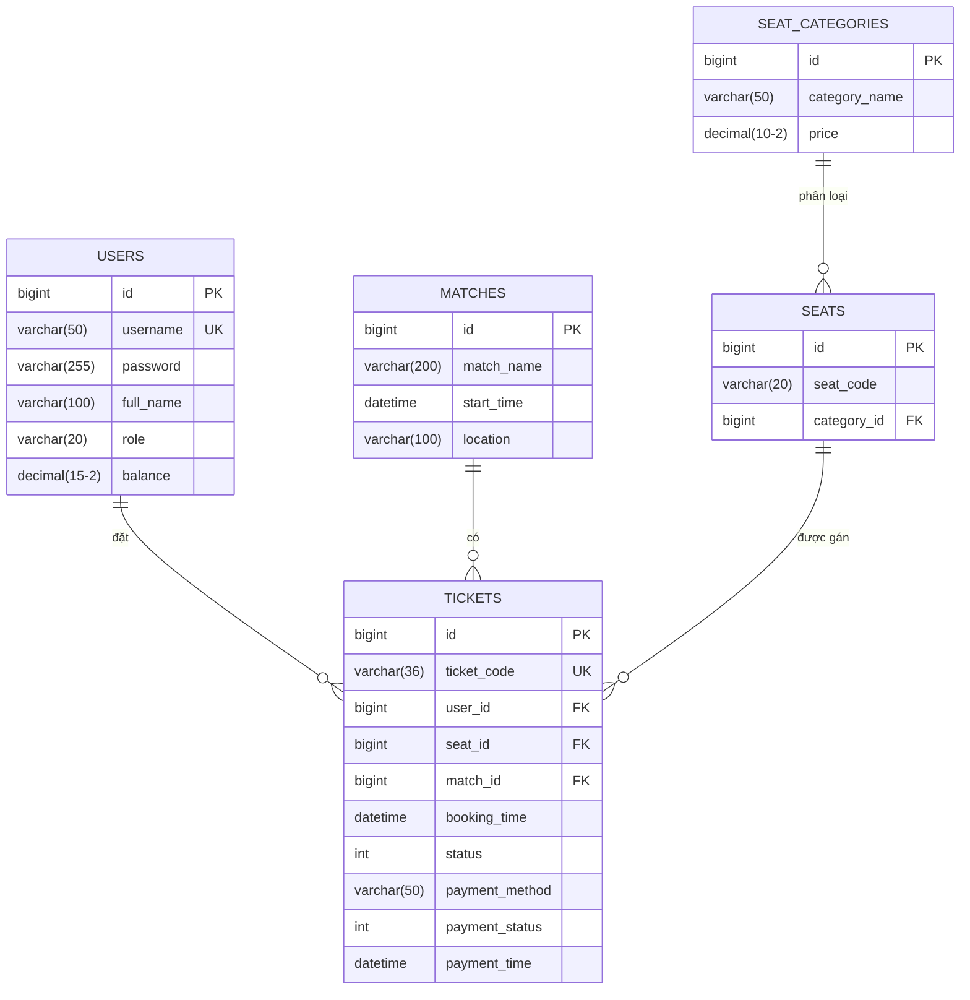

# 🏆 Hệ thống Quản lý Vé SEA Games 2025

> **Bài tập lớn môn Quản lý Dự án Hệ thống Thông tin**  
> Trường Đại học Thăng Long

---

## 📋 Mục lục

1. [Giới thiệu](#giới-thiệu)
2. [Công nghệ sử dụng](#công-nghệ-sử-dụng)
3. [Kiến trúc hệ thống](#kiến-trúc-hệ-thống)
4. [Cấu trúc thư mục](#cấu-trúc-thư-mục)
5. [Sơ đồ Use Case](#sơ-đồ-use-case)
6. [Đặc tả Use Case](#đặc-tả-use-case)
7. [Sơ đồ lớp (Class Diagram)](#sơ-đồ-lớp)
8. [Sơ đồ cơ sở dữ liệu](#sơ-đồ-cơ-sở-dữ-liệu)
9. [Hướng dẫn cài đặt](#hướng-dẫn-cài-đặt)

---

## Giới thiệu

Hệ thống quản lý vé SEA Games 2025 là ứng dụng web cho phép:
- **Người dùng**: Đăng ký, đăng nhập, nạp tiền ví, đặt vé, xem vé với QR Code
- **Quản trị viên**: Quản lý trận đấu, quản lý vé, check-in vé bằng QR Code

---

## Công nghệ sử dụng

### Backend
| Công nghệ | Phiên bản | Mô tả |
|-----------|-----------|-------|
| Java | 21 | Ngôn ngữ lập trình chính |
| Spring Boot | 4.0.1 | Framework phát triển web |
| Spring Data JPA | - | ORM Framework |
| MySQL | 8.x | Cơ sở dữ liệu quan hệ |
| Maven | 3.x | Quản lý dependencies |

### Frontend
| Công nghệ | Mô tả |
|-----------|-------|
| Thymeleaf | Template Engine |
| Bootstrap 5.3 | CSS Framework |
| Bootstrap Icons | Icon Library |
| QR Server API | Tạo mã QR Code |
| HTML5-QRCode | Quét mã QR |

---

## Kiến trúc hệ thống

Hệ thống được xây dựng theo **Clean Architecture** với 4 layer:

```
┌─────────────────────────────────────────────────────────┐
│                   PRESENTATION LAYER                    │
│              (Controllers, Templates)                   │
├─────────────────────────────────────────────────────────┤
│                   APPLICATION LAYER                     │
│                  (Services, DTOs)                       │
├─────────────────────────────────────────────────────────┤
│                     DOMAIN LAYER                        │
│              (Entities, Repositories)                   │
├─────────────────────────────────────────────────────────┤
│                 INFRASTRUCTURE LAYER                    │
│            (JPA Repositories, Config)                   │
└─────────────────────────────────────────────────────────┘
```

### Mô hình kiến trúc


---

## Cấu trúc thư mục

```
edu.tlu.seagame/
├── src/main/java/edu/thanglong/
│   ├── Application.java                 # Main class
│   │
│   ├── domain/                          # DOMAIN LAYER
│   │   ├── entity/
│   │   │   ├── User.java               # Người dùng
│   │   │   ├── Match.java              # Trận đấu
│   │   │   ├── Ticket.java             # Vé
│   │   │   ├── Seat.java               # Ghế
│   │   │   └── SeatCategory.java       # Loại ghế
│   │   └── repository/
│   │       ├── UserRepository.java
│   │       ├── MatchRepository.java
│   │       ├── TicketRepository.java
│   │       └── SeatRepository.java
│   │
│   ├── application/                     # APPLICATION LAYER
│   │   ├── dto/
│   │   │   ├── TicketDTO.java
│   │   │   ├── MatchDTO.java
│   │   │   ├── SeatDTO.java
│   │   │   └── CheckoutDTO.java
│   │   └── service/
│   │       ├── AuthService.java        # Xác thực
│   │       ├── BookingService.java     # Đặt vé
│   │       ├── AdminService.java       # Quản trị
│   │       ├── WalletService.java      # Ví tiền
│   │       └── MatchService.java       # Trận đấu
│   │
│   ├── presentation/                    # PRESENTATION LAYER
│   │   └── controller/
│   │       ├── AuthController.java     # /login, /register
│   │       ├── BookingController.java  # /booking, /checkout
│   │       ├── AdminController.java    # /admin/**
│   │       ├── WalletController.java   # /wallet
│   │       └── HomeController.java     # /, /matches
│   │
│   └── infrastructure/                  # INFRASTRUCTURE LAYER
│       ├── config/
│       │   ├── WebConfig.java
│       │   └── AuthInterceptor.java
│       └── persistence/
│           ├── JpaUserRepository.java
│           ├── JpaMatchRepository.java
│           ├── JpaTicketRepository.java
│           └── JpaSeatRepository.java
│
├── src/main/resources/
│   ├── templates/                       # Thymeleaf templates
│   │   ├── home.html
│   │   ├── login.html
│   │   ├── register.html
│   │   ├── matches.html
│   │   ├── booking.html
│   │   ├── checkout.html
│   │   ├── payment-success.html
│   │   ├── my-tickets.html
│   │   ├── ticket-detail.html
│   │   ├── wallet.html
│   │   ├── fragments/
│   │   │   └── layout.html
│   │   └── admin/
│   │       ├── dashboard.html
│   │       ├── tickets.html
│   │       ├── matches.html
│   │       ├── match-form.html
│   │       └── checkin.html
│   ├── static/
│   │   ├── css/style.css
│   │   └── js/main.js
│   └── application.properties
│
└── pom.xml
```

---

## Sơ đồ Use Case

### Sơ đồ Use Case tổng quát



### Phân rã Use Case - Đặt vé



### Phân rã Use Case - Quản lý trận đấu



---

## Đặc tả Use Case

### UC01: Đăng ký tài khoản

| Thuộc tính | Mô tả |
|------------|-------|
| **Tên** | Đăng ký tài khoản |
| **Mô tả** | Người dùng tạo tài khoản mới để sử dụng hệ thống |
| **Actor** | Người dùng (chưa đăng nhập) |
| **Điều kiện tiên quyết** | Chưa có tài khoản |
| **Luồng chính** | 1. Người dùng truy cập `/register`<br>2. Nhập username, password, họ tên<br>3. Nhấn "Đăng ký"<br>4. Hệ thống tạo tài khoản với số dư = 0<br>5. Chuyển đến trang đăng nhập |
| **Luồng ngoại lệ** | 3a. Username đã tồn tại → Báo lỗi |

---

### UC02: Đăng nhập

| Thuộc tính | Mô tả |
|------------|-------|
| **Tên** | Đăng nhập |
| **Mô tả** | Người dùng xác thực để truy cập hệ thống |
| **Actor** | Người dùng, Admin |
| **Điều kiện tiên quyết** | Đã có tài khoản |
| **Luồng chính** | 1. Truy cập `/login`<br>2. Nhập username, password<br>3. Hệ thống xác thực<br>4. Lưu session, chuyển trang chủ |
| **Luồng ngoại lệ** | 3a. Sai thông tin → Báo lỗi |

---

### UC03: Nạp tiền ví

| Thuộc tính | Mô tả |
|------------|-------|
| **Tên** | Nạp tiền ví |
| **Mô tả** | Người dùng nạp tiền vào ví để mua vé |
| **Actor** | Người dùng (đã đăng nhập) |
| **Điều kiện tiên quyết** | Đã đăng nhập |
| **Luồng chính** | 1. Truy cập `/wallet`<br>2. Nhập số tiền nạp<br>3. Nhấn "Nạp tiền"<br>4. Hệ thống cộng tiền vào ví |

---

### UC04: Đặt vé

| Thuộc tính | Mô tả |
|------------|-------|
| **Tên** | Đặt vé |
| **Mô tả** | Người dùng đặt vé xem trận đấu |
| **Actor** | Người dùng (đã đăng nhập) |
| **Điều kiện tiên quyết** | Có đủ số dư trong ví |
| **Luồng chính** | 1. Chọn trận đấu từ danh sách<br>2. Xem sơ đồ ghế<br>3. Chọn ghế trống<br>4. Xác nhận thông tin checkout<br>5. Hệ thống trừ tiền ví<br>6. Tạo vé + mã QR<br>7. Hiển thị trang thành công |
| **Luồng ngoại lệ** | 5a. Số dư không đủ → Yêu cầu nạp tiền |

---

### UC05: Check-in vé (Admin)

| Thuộc tính | Mô tả |
|------------|-------|
| **Tên** | Check-in vé |
| **Mô tả** | Admin xác nhận vé khi khách vào cổng |
| **Actor** | Admin |
| **Điều kiện tiên quyết** | Vé chưa được check-in |
| **Luồng chính** | 1. Truy cập `/admin/checkin`<br>2. Quét QR hoặc nhập mã 8 ký tự<br>3. Hệ thống tìm vé<br>4. Cập nhật trạng thái = "Đã check-in"<br>5. Hiển thị thông tin vé |
| **Luồng ngoại lệ** | 3a. Không tìm thấy vé → Báo lỗi<br>4a. Vé đã check-in → Báo lỗi |

---

## Sơ đồ lớp

### Class Diagram - Domain Layer



### Class Diagram - Service Layer



---

## Sơ đồ cơ sở dữ liệu

### ERD (Entity Relationship Diagram)



### Mô tả bảng dữ liệu

#### Bảng USERS
| Cột | Kiểu | Mô tả |
|-----|------|-------|
| id | BIGINT | Khóa chính, tự tăng |
| username | VARCHAR(50) | Tên đăng nhập, duy nhất |
| password | VARCHAR(255) | Mật khẩu (đã hash) |
| full_name | VARCHAR(100) | Họ tên đầy đủ |
| role | VARCHAR(20) | Vai trò: USER, ADMIN |
| balance | DECIMAL(15,2) | Số dư ví (VNĐ) |

#### Bảng MATCHES
| Cột | Kiểu | Mô tả |
|-----|------|-------|
| id | BIGINT | Khóa chính |
| match_name | VARCHAR(200) | Tên trận đấu |
| start_time | DATETIME | Thời gian bắt đầu |
| location | VARCHAR(100) | Địa điểm |

#### Bảng TICKETS
| Cột | Kiểu | Mô tả |
|-----|------|-------|
| id | BIGINT | Khóa chính |
| ticket_code | VARCHAR(36) | Mã vé UUID, duy nhất |
| user_id | BIGINT | FK → USERS |
| seat_id | BIGINT | FK → SEATS |
| match_id | BIGINT | FK → MATCHES |
| booking_time | DATETIME | Thời gian đặt |
| status | INT | 0: Mới, 1: Đã check-in |
| payment_method | VARCHAR(50) | Phương thức: WALLET |
| payment_status | INT | 0: Chờ, 1: Đã TT, 2: Hủy |
| payment_time | DATETIME | Thời gian thanh toán |

#### Bảng SEATS
| Cột | Kiểu | Mô tả |
|-----|------|-------|
| id | BIGINT | Khóa chính |
| seat_code | VARCHAR(20) | Mã ghế (A01, B02...) |
| category_id | BIGINT | FK → SEAT_CATEGORIES |

#### Bảng SEAT_CATEGORIES
| Cột | Kiểu | Mô tả |
|-----|------|-------|
| id | BIGINT | Khóa chính |
| category_name | VARCHAR(50) | Tên loại: VIP, Standard |
| price | DECIMAL(10,2) | Giá vé (VNĐ) |

---

## Hướng dẫn cài đặt

### Yêu cầu
- Java 21+
- MySQL 8.x
- Maven 3.x

### Các bước cài đặt

1. **Clone repository**
```bash
git clone <repository-url>
cd edu.tlu.seagame
```

2. **Tạo database MySQL**
```sql
CREATE DATABASE seagame_db CHARACTER SET utf8mb4 COLLATE utf8mb4_unicode_ci;
```

3. **Cấu hình database** (file `application.properties`)
```properties
spring.datasource.url=jdbc:mysql://localhost:3306/seagame_db
spring.datasource.username=root
spring.datasource.password=your_password
```

4. **Chạy ứng dụng**
```bash
.\mvnw.cmd spring-boot:run
```

5. **Truy cập**
- Trang chủ: http://localhost:8080
- Admin: http://localhost:8080/admin

### Tài khoản mặc định
| Username | Password | Role |
|----------|----------|------|
| admin | admin | ADMIN |

---

## 📝 Tác giả

- **Sinh viên**: [Tên sinh viên]
- **MSSV**: [Mã số sinh viên]
- **Lớp**: [Tên lớp]
- **Trường**: Đại học Thăng Long

---

© 2025 SEA Games Ticket Management System - Đại học Thăng Long
